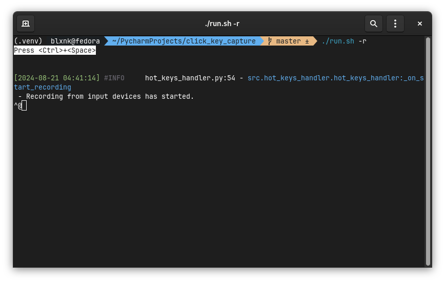
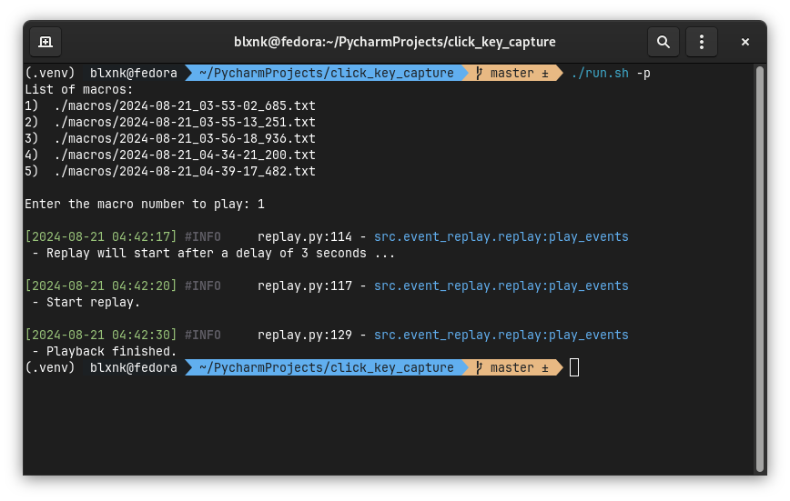

# Рекордер для записи событий мыши и клавиатуры

## Системные зависимости

Перед установкой убедитесь, что у вас установлены следующие пакеты:

```bash
sudo dnf install python3-devel ffmpeg xset
```

Также необходимо установить Python-зависимости:

```bash
pip install pynput coloredlogs
```

**Важно:** Для работы программы требуется Python версии 3.12 или выше.

## Описание

Это простой рекордер для записи событий мыши и клавиатуры для Linux.

### Цель

Программа предназначена для записи небольших скриптов, таких как действия для прохождения
капчей в браузере. Вы можете записать несколько фрагментов и использовать их по мере
необходимости.

### Текущие возможности

- Запись событий мыши и клавиатуры работает.
- Воспроизведение мыши работает более-менее стабильно.
- Воспроизведение событий клавиатуры рекомендуется только для латиницы, так как с другими
  раскладками могут возникнуть проблемы. Другие раскладки, это одна - русская.

## Управление

### Основные команды

Приложение поддерживает два режима: запись и воспроизведение.

#### Запись макроса

Для записи событий используйте команду:

```bash
./run.sh -r
```

Программа перейдет в режим записи, и начнет слушать передаваемые ей команды. Управление во
время записи осуществляется с помощью хоткеев:

- `<Ctrl>+<Space>` : начать/остановить запись
- `<Ctrl>+<C>` : выйти из программы



Опции для запуска:

- `-r` : запись (--record)
- `-k` : запись клавиатуры (--keyboard)
- `-m` : запись мыши (--mouse)

#### Воспроизведение макроса

Для воспроизведения макроса используйте команду:

```bash
./run.sh -p
```

В консоль будет выведен интерактивный диалог, со списком доступных для воспроизведения
макросов.

Во время воспроизведения доступно следующее управление:

- `<Ctrl>+<C>` : принудительно остановить воспроизведение и выйти



Опции для запуска:

- `-p` : воспроизведение (--play)
- `-d` : задержка перед воспроизведением (--delay)
- `3`  : задержка (в секундах) перед воспроизведением макроса

Если путь к макросу не указан, программа выведет список всех записанных макросов с
номерами и предложит ввести номер нужного макроса. По умолчанию каталог с макросами
находится в ./macros

#### Примеры использования

- `./run.sh -r`  
  Запустить запись клавиатуры и мыши.

- `./run.sh -rm`  
  Запустить запись только мыши.

- `./run.sh -rk`  
  Запустить запись только клавиатуры.

- `./run.sh -p`  
  Вывести список записанных макросов и предложить выбрать один для воспроизведения.

- `./run.sh -pd 5 macro.txt`  
  Воспроизвести макрос `macro.txt` с задержкой 5 секунд. Если задержка не указана,
  используется значение по умолчанию из настроек.

- `./run.sh -p macro.txt`  
  Воспроизвести макрос `macro.txt` с задержкой из файла конфигурации.

- `./run.sh -h`  
  Прочитать более детальное описание.

## Примечание

Программа была разработана и тестировалась на Fedora 40 с Gnome 46. Настройки приложения
можно изменить в файле `src.config.recorder_settings.py`.

**Внимание:** Программа является экспериментальной, и её использование не рекомендуется
для важных задач.

## Лицензии

### Используемые библиотеки

В этом проекте используется библиотека pynput версии 1.7.7, распространяемая под
лицензией LGPL v3. Исходный код библиотеки доступен
по https://github.com/moses-palmer/pynput.
